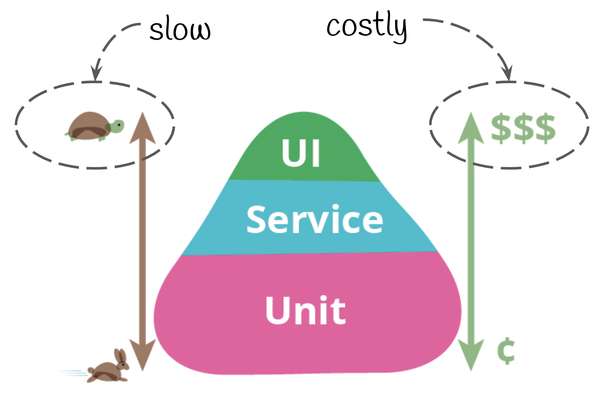

# TIPOS DE VERIFICAÇÕES

1. Build
2. Estática
3. Unitário
4. API
5. Funcional

### 1) Build

É a verificação que fazemos compilando o projeto, para verificar se o código está correto, se não está referenciando
nem um pacote ou variável inexistente, com detalhes mais básicos.

Tipos de empacotadores:

1.1) MAVEN/JAVA

### 2)Estárica

Verifica sem executar seu código, ou seja da forma que foi escrito seu código. Verifica se tem variáveis que não foram usadas, pontos do código que
possa causar nullpointer.

2.1) SONARQUBE

### 3)Unitário

São execuções no códigos, executar partes pequenas do código para verificar parâmetros distintos.

### 4)API

São testes direto na api

### 5)Funcional

São testes feitos diretos na interface gráfica como se fossem feitas diretamente pelo usuário.

